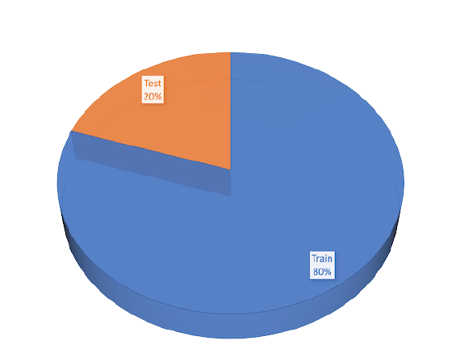
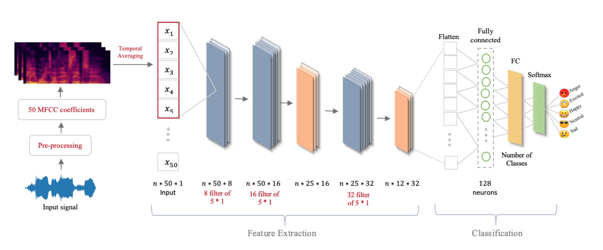

# deep-emotion-recognition
1D convolutional neural network for speech emotion recognition.<br>
Speech emotion recognition is performed in this project by classifying speech utterances based on their appropriate emotions. Sven different datasets with three different languages are identified as suitable candidates to evaluate a 1D Convolutional Neural Network (CNN) architecture. The data are first processed using Mel-Frequency Cepstral Coefficients (MFCC) feature extraction method.

### dataset
---

1. [EMOVO](http://voice.fub.it/activities/corpora/emovo/index.html) : an Italian Emotional Speech Database
It is a database built from the voices of up to 6 actors who played 14 sentences simulating 6 emotional states (*disgust, fear, anger, joy, surprise, sadness*) plus the neutral state. These emotions are the well-known Big Six found in most of the literature related to emotional speech. The recordings were made with professional equipment in the Fondazione Ugo Bordoni laboratories. The paper also describes a subjective validation test of the corpus, based on emotion-discrimination of two sentences carried out by two different groups of 24 listeners. The test was successful because it yielded an overall recognition accuracy of 80{\%}. It is observed that emotions less easy to recognize are joy and disgust, whereas the most easy to detect are anger, sadness and the neutral state.

2. [EMODB](https://zenodo.org/record/1188976) : German Database
The Berlin Database of Emotional Speech (EMODB) is a public German speech database that incorporates audio files with seven emotions: *happiness, sadness, anger, fear, disgust, boredom, and neutral*. The German utterances were recorded by five men and five women. Producing 10 utterances for each emotion. Twenty listeners evaluated the emotional labels of the utterances. The sentences had emo- tionally neutral contents and were recorded with a sampling rate of 48 kHz and downsampled to 16 kHz.

3. [TESS](https://tspace.library.utoronto.ca/handle/1807/24487) : Toronto emotional speech set
Toronto emotional speech set (TESS) is a public English speech database which has been developed in northwestern university. The database consists of recordings from two actresses (aged 26 and 64 years) in 7 different emotions(*anger, disgust, fear, happiness, pleasant surprise, sadness, and neutral*) , 2800 audio files in total. The format of the audio file is a WAV format. Also There are a set of 200 target words were spoken in the carrier phrase "Say the word _’. Dataset is female only with very high quality audio.

4. [SAVEE](http://kahlan.eps.surrey.ac.uk/savee/) : Surrey Audio-Visual Expressed Emotion
Surrey Audio-Visual Expressed Emotion (SAVEE) database has been recorded as a pre-requisite for the development of an automatic emotion recognition system. The database consists of recordings from 4 male actors in 7 different emotions, 480 British English utterances in total. The sentences were chosen from the standard TIMIT corpus and phonetically-balanced for each emotion. The data were recorded in a visual media lab with high quality audio-visual equipment, processed and labeled. To check the quality of performance, the recordings were evaluated by 10 subjects under audio, visual and audio-visual conditions. Classification systems were built using standard features and classifiers for each of the audio, visual and audio-visual modalities, and speaker-independent recognition rates of 61%, 65% and 84% achieved respectively.

5. [RAVDESS](https://zenodo.org/record/1188976#.YV_prWYzbzw) : The Ryerson Audio-Visual Database of Emotional Speech and Song
The Ryerson Audio-Visual Database of Emotional Speech and Song (RAVDESS) contains 7356 files (total size: 24.8 GB). The database contains 24 professional actors (12 female, 12 male), vocalizing two lexically-matched statements in a neutral North American accent. Speech includes *calm, happy, sad, angry, fearful, surprise, and disgust* expressions. Each expression is produced at two levels of emotional intensity (normal, strong), with an additional neutral expression.

6. [CREMA](https://github.com/CheyneyComputerScience/CREMA-D) : Crowd-sourced Emotional Multimodal Actors Dataset
CREMA-D is a data set of 7,442 original clips from 91 actors. These clips were from 48 male and 43 female actors between the ages of 20 and 74 coming from a variety of races and ethnicities (African America, Asian, Caucasian, Hispanic, and Unspecified).
Actors spoke from a selection of 12 sentences. The sentences were presented using one of six different emotions (Anger, Disgust, Fear, Happy, Neutral and Sad) and four different emotion levels (Low, Medium, High and Unspecified).
Participants rated the emotion and emotion levels based on the combined audiovisual presentation, the video alone, and the audio alone. Due to the large number of ratings needed, this effort was crowd-sourced and a total of 2443 participants each rated 90 unique clips, 30 audio, 30 visual, and 30 audio-visual. 95% of the clips have more than 7 ratings.

7. [SHEMO](https://www.kaggle.com/mansourehk/shemo-persian-speech-emotion-detection-database) : Persian Speech Emotion Detection Database
Sharif Emotional Speech Database (ShEMO) 1 is a public Persian speech database that contains 3000 natural utterances in .wav format, 16 bit, recorded with sam-pling rate of 44.1 kHz and mono and extracted 3 h and 25 min of utterances from
radio plays which are broadcasting online. The ShEMO Database contains speech samples of 87 native-Persian speakers (31 females, 56 males) and has audio files with five emotional states such as *anger, fear, happiness, sadness and surprise, as well as neutral* state along with the orthographic and phonetic transcriptions.

### Preprocessing
---
Pre-processing is on of the main part of preparing input signal to achieve model accuracy and efficiency. First, we loaded the audio files into python 3.6 using LibROSA library. We used original sample rate (22 Hz) and bit-depth For having a consistent sampling rate across all databases and audio is provided in stereo and normalized to a mono format. For each utterance in the dataset, we extract Mel-frequency cepstral coefficients features named **[MFCCS](http://practicalcryptography.com/miscellaneous/machine-learning/guide-mel-frequency-cepstral-coefficients-mfccs/)(50 coefficients)**. We chose **‘Hann’** as window function. Window size is 512 (23 milliseconds at a sample rate of 22050 Hz) and a hop_length of 256 or 50% overlap which provides a good balance between performance and computational complexity. The shape of an MFCC output for each utterance is a 2D matrix format with MFCC bands on the y-axis and time on the x-axis, representing the MFCC bands over time. We visualized the MFCC of three different emotions such as neural, sad and happy which shown in the figure below. 


As mentioned, the output of MFCC is a 2D matrix format with MFCC bands on the y-axis and time on the x-axis. To simplify things, we take the mean value across each band over time. In other words, we take the mean value on each row. So, after taking mean value we have a vector of features instead of a 2D matrix which is the same with number of MFCC. This vector will be input to our Convolutional neural network.

#### Training and Test Sets
At first we divided whole datasets (EMODB, EMOVO, TESS, CREMA, RAVDESS, SHEMO, SAVEE) for training purpose and testing purpose with each **80%** and **20%** of the data respectively. Then we have computed the **MFCC features (50 coefficients)** for each utterance in training dataset and test dataset also. Finally, the labels of the training and the test data were encoded as **one-hot** vectors and fed them to our CNN network.<br>

<p align="center"></p>

### Architecture
---


The propose architecture of the deep neural network for SER is shown in figure above. The architecture of the deep neural network that was implemented in our study was a one-dimensional convolutional neural network(1D CNN) with three convolutional layers and one fully connected layer with 128 hidden neurons. As we mentioned before, we have three databases with different number of classes. There- fore, depending on the number of classes for each database, have used “softmax” as activation function for the final output nodes to estimate the probability distribution of the classes. We have use max-polling after second and third convolution layer. We chose Rectified Linear Units (ReLU) in convolutional and fully connected layers as activation function to reduce the occurrence of over-fitting problem and introduce nonlinearity to the model. The initial number of kernels was set to 8 and 16 for the first and the second convolutional layers and 32 for the third convolution layer, respectively. Also, the size of each convolution filter is 5 ∗ 1 with 1 stride and ’same’ padding to generate feature maps. the kernel size for max-pooling is 2 with 2 strides and ’same’ padding. We have used Xavier initialize At the fully connected layer to tune initial weight’s values. cross-entropy minimization was used as the loss function and Adam with parameters lr=0.0001 as the optimize. The number of training iteration was 500. Further, we incorporated the dropout operation after the third convolution layer to prevent overfitting and improve the performance.


### Installing dependencies
---
Note: You can skip this step, if you are installing the packages. Dependencies are listed in the requirements.txt file.
#### Requirements
* numpy
* pandas
* librosa==0.8.1
* soundfile==0.10.3
* matplotlib==3.4.3
* tqdm
* tensorflow
* keras==2.4.0
* seaborn
* scikit-learn==2.6.0
* rich==10.12.0

After you cloned the repository, you need to create a virtual environment, so you have a clean python installation. You can do this by running the command
```sh
python -m venv env
```
After creating virtual environment, it is necessary to activate the virtual environment. You can install all the required dependencies by running
```sh
pip install -r requirements.txt
```
### Usage
---
After cloning the repository and create vitual enviroment you can follow the instructions below to prepare dataset and  run the neural network for traing and testing data.

**step 1**  :***Download Dataset*** <br>
There is a folder for each dataset in the dataset folder. In the first step, you should choose a dataset such as EMODB, EMOVO, TESS ... which wanna work on this and download it from the above links. After downloaing, put it into the appropiate folder in dataset folder. For instance, you supposed to train neural network on ***RAVDESS*** dataset. After downloadind ***RAVDESS***, Then put the entire dataset in to the ***datasets/RAVDESS/***.

**step 2**  :***Creating CSV file of each dataset and split data to train and test (80/20)*** <br>
In the second step, should create a CSV file of selected dataset. Run the code below to create a CSV file and save it automatically into the ***datasets/csv/*** directory.
```sh
python3 dataset.py -d ./datasets/RAVDESS/ -n ravdess
```
##### parameters

Long option | Option | Description
----------- | ------ | -----------
--dataset | -d | dataset path
--dataset_name | -n | dataset name

After executing the above code, a file with the CSV format similar to the name of dataset will be created in the datasets/csv/ folder, which contains train and test data of the selected dataset. 

**step 3: Building Models**
Since the project is a classification problem, 1D Convolution Neural Network is the obivious choice.
Building and tuning a model is a very time consuming process so run the code below to train our model on a certain dataset.
```sh
python find_best_model.py -d "ravdess" -p [ravdess csv path] -l -a -s -c
```
example: 
```sh
python3 deep_emotion_recognition -d ravdess -p datasets/csv/ravdess.csv -l -a -s -c
```
##### parameters
Long option | Option | Description
----------- | ------ | -----------
--dataset | -d | dataset path
--csv_path | -p | csv name
--load_data | -l | Load data and feature extracting and split to train and test
--show_accuracy | -a | Show accuracy plot for train and test data
--save_model | -s | Save model into the model folder
--plot_confusion | -c | Plot confusion matrix for determine how model predict well

After runnig the above code, you need to wait a short time to train the neural network for specific dataset. Then see the result with choosing an appropriate parameters.

**step 4: Predictions**
After tuning the model, tested it out by predicting the emotions for the test data. use below code to predict the probability of a wav sound which blong to a dataset. 
```sh
python3 prediction.py -p [path of wav sound] -m [path of model]
```
example:
```sh
python3 prediction.py -p ./datasets/RAVDESS/Actor_16/03-01-03-02-01-01-16.wav -m ./model/ravdess_best_model.h5
```