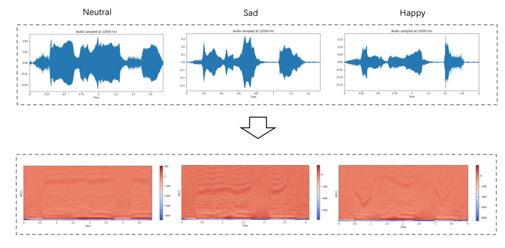

# deep-emotion-recognition
1D convolutional neural network for speech emotion recognition. 
Speech emotion recognition is performed in this project by classifying speech utterances based on their appropriate emotions. Sven different datasets with three different languages are identified as suitable candidates to evaluate a 1D Convolutional Neural Network (CNN) architecture. The data are first processed using Mel-Frequency Cepstral Coefficients (MFCC) feature extraction method.

### dataset
---

1. [EMOVO](http://voice.fub.it/activities/corpora/emovo/index.html) : an Italian Emotional Speech Database
It is a database built from the voices of up to 6 actors who played 14 sentences simulating 6 emotional states (*disgust, fear, anger, joy, surprise, sadness*) plus the neutral state. These emotions are the well-known Big Six found in most of the literature related to emotional speech. The recordings were made with professional equipment in the Fondazione Ugo Bordoni laboratories. The paper also describes a subjective validation test of the corpus, based on emotion-discrimination of two sentences carried out by two different groups of 24 listeners. The test was successful because it yielded an overall recognition accuracy of 80{\%}. It is observed that emotions less easy to recognize are joy and disgust, whereas the most easy to detect are anger, sadness and the neutral state.

2. [EMODB](https://zenodo.org/record/1188976) : German Database
The Berlin Database of Emotional Speech (EMODB) is a public German speech database that incorporates audio files with seven emotions: *happiness, sadness, anger, fear, disgust, boredom, and neutral*. The German utterances were recorded by five men and five women. Producing 10 utterances for each emotion. Twenty listeners evaluated the emotional labels of the utterances. The sentences had emo- tionally neutral contents and were recorded with a sampling rate of 48 kHz and downsampled to 16 kHz.

3. [TESS](https://tspace.library.utoronto.ca/handle/1807/24487) : Toronto emotional speech set
Toronto emotional speech set (TESS) is a public English speech database which has been developed in northwestern university. The database consists of recordings from two actresses (aged 26 and 64 years) in 7 different emotions(*anger, disgust, fear, happiness, pleasant surprise, sadness, and neutral*) , 2800 audio files in total. The format of the audio file is a WAV format. Also There are a set of 200 target words were spoken in the carrier phrase "Say the word _’. Dataset is female only with very high quality audio.

4. [SAVEE](http://kahlan.eps.surrey.ac.uk/savee/) : Surrey Audio-Visual Expressed Emotion
Surrey Audio-Visual Expressed Emotion (SAVEE) database has been recorded as a pre-requisite for the development of an automatic emotion recognition system. The database consists of recordings from 4 male actors in 7 different emotions, 480 British English utterances in total. The sentences were chosen from the standard TIMIT corpus and phonetically-balanced for each emotion. The data were recorded in a visual media lab with high quality audio-visual equipment, processed and labeled. To check the quality of performance, the recordings were evaluated by 10 subjects under audio, visual and audio-visual conditions. Classification systems were built using standard features and classifiers for each of the audio, visual and audio-visual modalities, and speaker-independent recognition rates of 61%, 65% and 84% achieved respectively.

5. [RAVDESS](https://zenodo.org/record/1188976#.YV_prWYzbzw) : The Ryerson Audio-Visual Database of Emotional Speech and Song
The Ryerson Audio-Visual Database of Emotional Speech and Song (RAVDESS) contains 7356 files (total size: 24.8 GB). The database contains 24 professional actors (12 female, 12 male), vocalizing two lexically-matched statements in a neutral North American accent. Speech includes *calm, happy, sad, angry, fearful, surprise, and disgust* expressions. Each expression is produced at two levels of emotional intensity (normal, strong), with an additional neutral expression.

6. [CREMA](https://github.com/CheyneyComputerScience/CREMA-D) : Crowd-sourced Emotional Multimodal Actors Dataset
CREMA-D is a data set of 7,442 original clips from 91 actors. These clips were from 48 male and 43 female actors between the ages of 20 and 74 coming from a variety of races and ethnicities (African America, Asian, Caucasian, Hispanic, and Unspecified).
Actors spoke from a selection of 12 sentences. The sentences were presented using one of six different emotions (Anger, Disgust, Fear, Happy, Neutral and Sad) and four different emotion levels (Low, Medium, High and Unspecified).
Participants rated the emotion and emotion levels based on the combined audiovisual presentation, the video alone, and the audio alone. Due to the large number of ratings needed, this effort was crowd-sourced and a total of 2443 participants each rated 90 unique clips, 30 audio, 30 visual, and 30 audio-visual. 95% of the clips have more than 7 ratings.

7. [SHEMO](https://www.kaggle.com/mansourehk/shemo-persian-speech-emotion-detection-database) : Persian Speech Emotion Detection Database
Sharif Emotional Speech Database (ShEMO) 1 is a public Persian speech database that contains 3000 natural utterances in .wav format, 16 bit, recorded with sam-pling rate of 44.1 kHz and mono and extracted 3 h and 25 min of utterances from
radio plays which are broadcasting online. The ShEMO Database contains speech samples of 87 native-Persian speakers (31 females, 56 males) and has audio files with five emotional states such as *anger, fear, happiness, sadness and surprise, as well as neutral* state along with the orthographic and phonetic transcriptions.

### Preprocessing
---
Pre-processing is on of the main part of preparing input signal to achieve model accuracy and efficiency. First, we loaded the audio files into python 3.6 using LibROSA library. We used original sample rate (22 Hz) and bit-depth For having a consistent sampling rate across all databases and audio is provided in stereo and normalized to a mono format. For each utterance in the dataset, we extract Mel-frequency cepstral coefficients features named **MFCCs (50 coefficients)**. We chose **‘Hann’** as window function. Window size is 512 (23 milliseconds at a sample rate of 22050 Hz) and a hop_length of 256 or 50% overlap which provides a good balance between performance and computational complexity. The shape of an MFCC output for each utterance is a 2D matrix format with MFCC bands on the y-axis and time on the x-axis, representing the MFCC bands over time. We visualized the MFCC of three different emotions such as neural, sad and happy which shown in the figure below.

